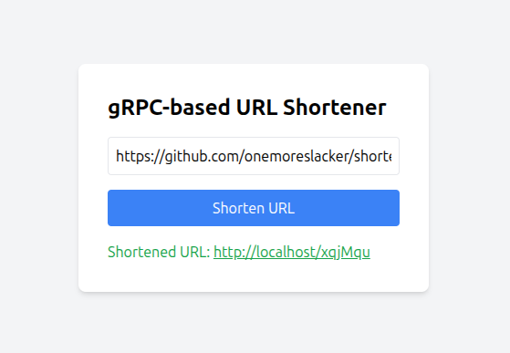
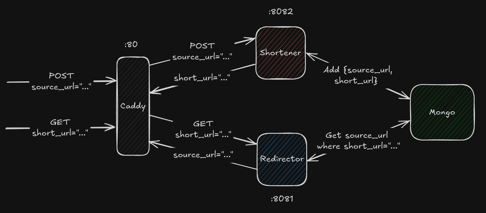

# Shortener


  


<!-- TOC -->
- [Overview](#overview)
- [Prerequisites](#prerequisites)
- [Installation](#installation)
- [Usage](#usage)
- [Architecture](#architecture)
<!-- /TOC -->

## Overview

The project consists of two main services:

*   **Shortener Service**: Handles the creation of short URLs.
*   **Redirector Service**: Handles the redirection from short URLs to the original URLs.
## Getting Started

### Prerequisites

*   [Docker](https://docs.docker.com/get-docker/)
*   [Docker Compose](https://docs.docker.com/compose/install/)

### Installation

1.  Clone the repository:

    ```bash
    git clone https://github.com/onemoreslacker/shortener.git
    ```
2.  Navigate to the project directory:

    ```bash
    cd shortener
    ```
3.  Create a `.env` file from the example:

    ```bash
    cp deploy/.env.example deploy/.env
    ```
4.  Run the services using Docker Compose:

    ```bash
    make up
    ```

This will start the `shortener` and `redirector` services, along with a MongoDB instance and a Caddy reverse proxy.

## Usage

<p align="center" width="100%">
    
</p>

You can access web interface via the link `http://localhost:80`, paste link which you want to shorten and get the shortened link.

## Architecture

<p align="center" width="100%">
    
</p>
